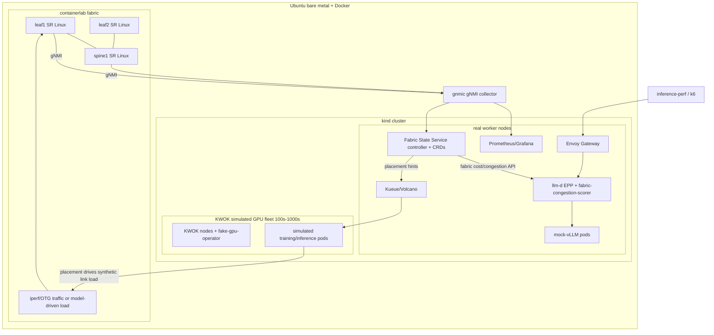

# GPU Fabric Simulation with k8s, llm-d, and containerlab

> IMPORTANT: Everything in this plan runs on the `tcow` Ubuntu bare-metal node (via Remote-SSH), NOT on the local Mac. Connect Cursor to `tcow` and open the project folder there before executing any phase, so all terminal/tooling (Docker, containerlab, kind, KWOK) executes on `tcow`.

## Goal

Simulate a GPU network fabric with no GPUs, on one Ubuntu bare-metal node, keeping resources low and focusing on scheduling / orchestration / control plane. Then build a networking controller that injects fabric state into llm-d's routing (EPP) and into batch placement to improve scheduling and speed.

## Tool stack (the "which tools" answer)

- Host: Ubuntu bare metal + Docker/containerd, Go toolchain, `kubectl`, `helm`, `kustomize`.
- Kubernetes: `kind` (control plane + 1-2 real workers for pods that must actually run). Alt: `k3s` if you want lighter. kind chosen for clean `clabernetes`/`meshnet` integration when you add real traffic (phase C) later.
- Simulated GPU fleet (large scale): `KWOK` (Kubernetes WithOut Kubelet) for 100s-1000s of virtual nodes with near-zero footprint.
- Fake GPUs: run.ai `fake-gpu-operator` to advertise `nvidia.com/gpu` on KWOK nodes (no NVML needed here).
- Network fabric: `containerlab` running Nokia `SR Linux` (free image, first-class gNMI/YANG streaming telemetry) in a leaf-spine / rail-optimized topology. Ultralight fallback: `FRR` (smaller RAM, but weaker telemetry).
- Fabric telemetry: `gnmic` (gNMI collector) -> `Prometheus` -> `Grafana`. containerlab ships a gnmic/Prometheus/Grafana lab stack you can reuse.
- Inference layer: `llm-d` = Gateway API Inference Extension (`InferencePool`) + `llm-d-inference-scheduler` (the EPP "router") + an L7 proxy (`Envoy Gateway` / kgateway). Endpoints are mock-vLLM pods, not real vLLM.
- Batch/training orchestration: `Kueue` or `Volcano` (gang scheduling) + `JobSet` for simulated distributed training. Optional: `sigs.k8s.io/scheduler-plugins` (Diktyo network-aware plugin) as prior art / base for network-aware placement.
- Load generation: `inference-perf` / `guidellm` / `k6` for inference traffic; a small job generator for training jobs.
- Observability: `Prometheus` + `Grafana` (+ optional OpenTelemetry) for fabric utilization, EPP routing decisions, and request latency.

## Custom components you build (the research contribution)

1. Mock-vLLM server (Go or Python): OpenAI-compatible `/v1/completions` + vLLM-style `/metrics` (`num_requests_waiting`, KV-cache utilization, etc.). Injects synthetic processing delay as a function of queue depth + KV state + fabric-path congestion, so better routing => lower measured latency.
2. Fabric State Service = the "networking controller" (Go, controller-runtime):
  - Inputs: static containerlab topology + live gNMI telemetry (via gnmic/Prometheus): per-link utilization, queue depth, latency, BGP/route state.
  - Model: node-to-fabric mapping (which KWOK node sits on which leaf/rail), pairwise network cost/congestion, hot links.
  - CRDs: `NetworkFabric`, `FabricLink`, `NodeFabricLocation` for a k8s-native, inspectable state.
  - Output: gRPC/HTTP API + Prometheus metrics consumed by the EPP scorer and scheduler plugin.
3. EPP custom scorer plugin (Go, llm-d-inference-scheduler plugin API): `fabric-congestion-scorer` / `network-proximity-scorer`. Scores candidate serving pods by network distance + path congestion from the request's ingress (or, for disaggregated prefill/decode, from the KV-cache source pod). Wired in via `EndpointPickerConfig` YAML with a `weight` in a `SchedulingProfile`.
4. (Optional) Batch scheduler plugin: network-topology-aware placement for training gang jobs, reusing/extending Diktyo from `scheduler-plugins`.

## Architecture

## Phased build

- Phase 0 - Host prep (on `tcow`): connect to `tcow` via Remote-SSH and open the project folder there first; then install Docker, Go, kubectl, helm; pull SR Linux + kind + KWOK images. All subsequent phases run on `tcow`.
- Phase A - Cluster + fleet: kind cluster; install KWOK; install fake-gpu-operator; generate N KWOK GPU nodes labeled with fabric location (rack/rail/leaf). Verify `nvidia.com/gpu` is allocatable and pods "schedule".
- Phase B - Fabric: containerlab leaf-spine (SR Linux); configure gNMI; stand up gnmic -> Prometheus -> Grafana; confirm live interface/queue telemetry.
- Phase C - Fabric State Service: controller + CRDs; ingest topology + telemetry; expose network-cost API and metrics; reconcile `NodeFabricLocation` for KWOK nodes.
- Phase D - llm-d + mock endpoints: install Envoy Gateway + InferencePool + EPP; deploy mock-vLLM pods (with fabric-aware latency) on real nodes; baseline route with default scorers.
- Phase E - Network-aware routing: implement + load the custom EPP scorer; A/B measure latency with scorer on vs off using inference-perf. This is the core "improve scheduling and speed" result.
- Phase F - Training placement: Kueue/Volcano gang jobs across KWOK fleet; network-aware placement; placement drives synthetic fabric load closing the telemetry loop.
- Phase G (later) - Hybrid real traffic: use `clabernetes` + `meshnet`/`multus` to stitch one real pod-to-pod path through the NOS fabric for a validation demo.

## Notes / decisions I made

- SR Linux over Arista cEOS (no account/license needed) and over FRR (better telemetry) - swap to FRR only if RAM-constrained.
- kind over k3s for smoother containerlab/clabernetes integration in phase G.
- EPP scorer is the primary integration point for inference "speed"; batch scheduler plugin is secondary for training placement.

