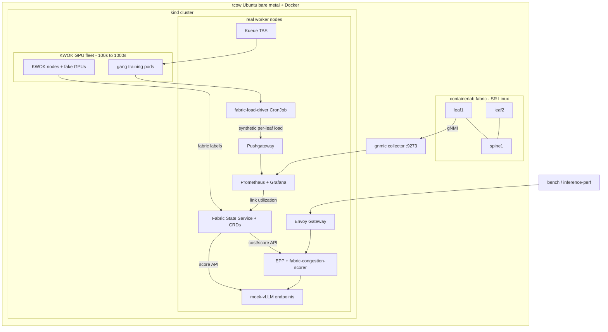

# Runbook: ai-fabric

Operational guide for the GPU-fabric simulation. Everything runs on the **tcow**
Ubuntu node (connect via Remote-SSH, open this folder there).

## Data flow



Two scheduling loops consume the same fabric state:
1. **Inference routing** — the EPP fabric scorer picks network-close, low-congestion
   `mock-vLLM` endpoints; mock latency reflects fabric position, so routing shows up as latency.
2. **Training placement** — Kueue TAS packs gang jobs within a leaf; their placement
   is pushed back as synthetic link load, which then influences inference routing.

## Phase order

| Make target | Phase | Result |
|-------------|-------|--------|
| `make host-prep` | 0 | toolchain on tcow |
| `make cluster` | A | kind + KWOK + fake-gpu-operator |
| `make fleet GPU_NODES=200` | A | simulated GPU nodes with fabric labels |
| `make fabric` | B | SR Linux leaf/spine + gnmic |
| `make observability` | B | Prometheus + Grafana |
| `make fabric-state` | C | Fabric State Service + CRDs |
| `make llmd` | D | Gateway + InferencePool + EPP (baseline) |
| `make mock-vllm` | D | fabric-aware serving endpoints |
| `make epp-scorer` | E | custom EPP + fabric-aware config |
| `make bench` | E | A/B latency: baseline vs fabric |
| `make training` | F | Kueue gang jobs + feedback loop |
| `make hybrid` | G | (optional) real traffic through the fabric |

## Verification cheatsheet

```bash
make status                                   # one-shot health snapshot
curl -s localhost:9273/metrics | grep fabric_ # gnmic telemetry (host)
kubectl get networkfabric default -o yaml     # controller's fabric summary CR
kubectl -n ai-fabric-system port-forward svc/fabric-state-service 8080 &
curl -s 'localhost:8080/api/v1/cost?from=gpu-0001&to=gpu-0050' | jq
kubectl -n llm-d port-forward svc/llm-d-epp 9090 &
curl -s localhost:9090/metrics | grep fabric_scorer_
```

## Known caveats / things to confirm on tcow

- **gnmic metric names.** `telemetry.go`, the Grafana dashboard, and the
  `fabric-load-driver` all assume the series `fabric_if_counters_out_octets{source="clab-fabric-<node>"}`.
  gnmic's exact name depends on `metric-prefix` / `append-subscription-name`. After
  `make fabric`, run `curl -s localhost:9273/metrics | grep octets` and, if the name
  differs, update the query in
  [`fabric-state-service/telemetry.go`](../fabric-state-service/telemetry.go) and the
  dashboard once.
- **llm-d / GIE versions.** CRD URLs, the EPP image, and the EPP CLI flags in
  [`llm-d/`](../llm-d) and [`.env.example`](../.env.example) are pinned to plausible
  versions; align them with the `gateway-api-inference-extension` / llm-d release you
  target. The custom EPP (`epp-scorer/`) has `go mod tidy` + build behind the `gie`
  tag; confirm the `framework.Scorer` signature and `plugins.Register` API for that
  version (comments mark both spots).
- **SR Linux credentials.** Default `admin` / `NokiaSrl1!` (used by gnmic config).
- **KWOK pods don't run containers.** That's why serving endpoints and controllers
  use `nodeSelector: ai-fabric.io/real: "true"`, and why each mock-vLLM carries a
  *simulated* fabric identity via label instead of using its real host node.

## RAM guidance

Dominant cost is the SR Linux fabric (~1.5-2 GB/node), not KWOK (near-free).

- ~16 GB: FRR fabric + modest fleet (phases A-C).
- 32 GB: small SR Linux fabric (4-6 nodes) + large KWOK fleet (recommended).
- 64 GB: full SR Linux fabric + 1000s of KWOK nodes + heavy pod counts + Phase G.

Cut RAM with `FABRIC_NOS=frr`, fewer switches, and fewer *pods* (etcd is the real
scaler at fleet size), not fewer KWOK nodes.
